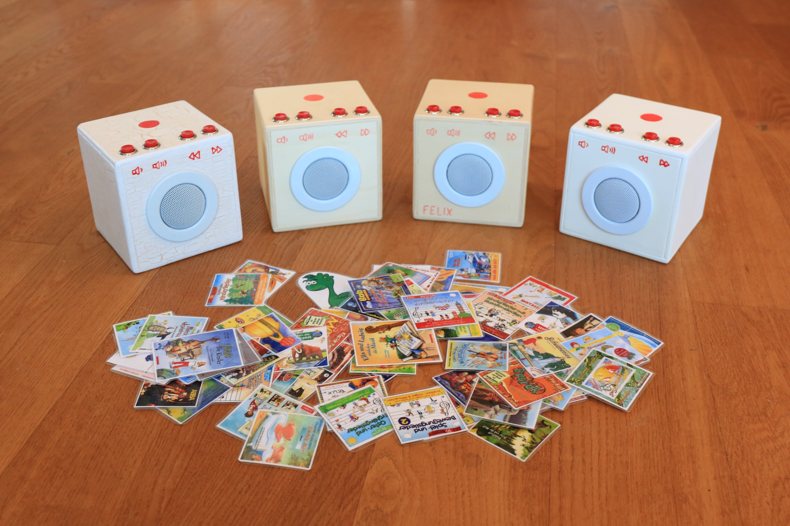

# sepPI
Simple audio player box for kids with RFID tags based on RaspberryPI.

The main focus is kids, but not only. It can play music, radio plays and web radio streams.
The handling of the box is designed to be simple: select the audio content with prepared RFID
tags and control audio volume and track number with just 4 buttons.

## Hardware List

* RaspberryPI ZERO WH, RaspberryPI 1 Model A+ (but any RaspberryPI with 40pin header should do)
* WLAN dongle (if the RaspberryPI does not already have WIFI)
* Micro USB power supply
* SD card
* PN532 RFID reader (RECOMMENDED)
* MFRC522 RFID reader (NOT RECOMMENDED; bad experience with signal strength)
* MAX98357 I2S Class-D Mono Amplifier
* 4 or 8 Ohm speaker
* 4 push buttons
* female-female jumper wires
* soldering utilities

## Wiring

                                 RaspberryPI
                         +------------+------------+
                         | GPIO   PIN | PIN   GPIO |
                         +------------+------------+
          PN532.VCC  <-- | PWR 3V3  1 | 2   5V PWR |
          PN532.SDA  <-- | 2   SDA  3 | 4   5V PWR | --> MAX98357.Vin (*)
          PN532.SCL  <-- | 3   SCL  5 | 6   GROUND | --> MAX98357.GND (*)
                         | 4        7 | 8       14 |
          PN532.GND  <-- | GROUND   9 | 10      15 |
                         | 17      11 | 12 CLK  18 | --> MAX98357.BCLK
                         | 27      13 | 14  GROUND | --> button volume+
                         | 22      15 | 16      23 | --> button volume+
          RC522.3.3V <-- | PWR 3V3 17 | 18      24 | --> button volume-
          RC522.MOSI <-- | 10 MOSI 19 | 20  GROUND | --> button volume-
          RC522.MISO <-- | 9  MISO 21 | 22      25 | --> RC522.RST
          RC522.SCK  <-- | 11 SCLK 23 | 24 CE0   8 | --> RC522.SDA
          RC522.GND  <-- | GROUND  25 | 26 CE1   7 |
          RC522.IRQ  <-- | 0       27 | 28       1 |
                         | 5       29 | 30  GROUND | --> button next
                         | 6       31 | 32      12 | --> button next
                         | 13      33 | 34  GROUND | --> button prev
      MAX98357.LRCLK <-- | 19   FS 35 | 36      16 | --> button prev
                         | 26      37 | 38 DIN  20 |
                         | GROUND  39 | 40 DOUT 21 | --> MAX98357.DIN
                         +------------+------------+

                                 RFID-PN532
                         +-------------------------+
                         |    _________________    |
                         |   / _______________ \   |
    RPI.09 (GND)     <-- | GND                \ \  |
    RPI.01 (3V3)     <-- | VCC                 | | |
    RPI.03 (SDA)     <-- | SDA                 | | |
    RPI.05 (SCL)     <-- | SCL _______________/ /  |
                         |   \_________________/   |
                         |                         |
                         +-------------------------+

                                 RFID-RC522
                         +--------+----------------+
    RPI.24 (CE0)     <-- | SDA    |    ________    |
    RPI.23 (SCK)     <-- | SCK    |   / ______ \   |
    RPI.19 (MOSI)    <-- | MOSI   |  / /      \ \  |
    RPI.21 (MISO)    <-- | MISO   | | |        | | |
    RPI.27 (GPIO 0)  <-- | IRQ    | | |        | | |
    RPI.25 (GROUND)  <-- | GND    |  \ \______/ /  |
    RPI.22 (GPIO 25) <-- | RST    |   \________/   |
    RPI.17 (PWR 3V3) <-- | 3.3V   |                |
                         +--------+----------------+

                                  MAX98357
                            +------------------+
        RPI.35 (FS)     <-- | LRCLK            |
        RPI.12 (CLK)    <-- | BCLK             |
        RPI.40 (DOUT)   <-- | DIN     OUTPUT - | --> SPEAKER -
                            | GAIN             |
                            | SD      OUTPUT + | --> SPEAKER +
    (*) RPI.6  (GROUND) <-- | GND              |
    (*) RPI.4  (5V PWR) <-- | Vin              |
                            +------------------+

(\*) There are some insteresting issues with the power supply of the MAX98357. The first boxes
were built with the RaspberryPI 1 Model A+. The speaker only worked when it was touched. There
was some problem with the voltage potentials. Connecting the MAX98357 to the power supply
directly (without going through the RaspberryPI) solved the problem.

Newer boxes were built with the RaspberryPI ZERO WH. There it is the other way round. Therefore
the power supply of the MAX98357 had to be taken from the pins of the RaspberryPI.

## Setup RaspberryPI

Install Raspbian on the SD cardi...

* choose `seppi` as the default user name and set a password for this user.

...and do initial setup with raspi-config:

* change the hostname (RECOMMENDED)
* setup WiFi (RECOMMENDED)
* boot into console (RECOMMENDED)
* enable SSH server (RECOMMENDED)
* enable I2C (REQUIRED)

Install additional software with `apt install`:

* mpd (REQUIRED)
* mpc (REQUIRED)
* libfind-lib-perl (REQUIRED)
* libterm-readkey-perl (RECOMMENDED; for assignTag.pl)
* libio-all-lwp-perl (OPTIONAL; for TTS speach synthesis)
* git (OPTIONAL; for installation from GitHub)

Configure `/etc/mpd.conf` and set:

    music_directory       /home/seppi/music
    playlist_directory    /home/seppi/playlists
    metadata_to_use       none
    replaygain            track
    
    audio_output {
        type    "alsa"
        name    "My ALSA Device"
    }

Enable `mpd` at system start:

    systemctl enable mpd
    systemctl start mpd

## Setup Adafruit MAX98357 Amplifier

As a reference, please use the guide on:

* <https://learn.adafruit.com/adafruit-max98357-i2s-class-d-mono-amp/>

The detailed install instructions do not seem to work, though. In /boot/firmware/config.txt the
`dtoverlay=dtoverlay=max98357a` should actually be `dtoverlay=hifiberry-dac`:

    # /boot/firmware/config.txt
    
    #dtparam=audio=on
    dtoverlay=vc4-kms-v3d,noaudio
    dtoverlay=hifiberry-dac

## I2C

    sudo apt-get install libusb-dev libpcsclite-dev i2c-tools libnfc-bin libnfc-examples libnfc-pn53x-examples

Add to `/etc/nfc/libnfc.conf`:

    device.name = "_PN532_I2c"
    device.connstring = "pn532_i2c:/dev/i2c-1"

## Dependencies

The software depends on the Perl implementation of BCM2835 that itself depends on a C implementation.
First, the C library need to be installed via apt:

    apt install libbcm2835-dev

Then get the Perl module from https://metacpan.org/pod/Device::BCM2835, unpack it and install the module with:

    perl Makefile.PL
    make
    make test
    sudo make install

## Installation

Simply clone the Github repository into the `seppi` user's home directory `/home/seppi/` with

    git clone https://github.com/f05fk/sepPI.git

There are different possibilities for starting the application. The most simple way is to add sepPI.sh to
`/etc/rc.local`. Newer versions of Raspbian do not have an `/etc/rc.local` any more, so it must be created:

    #!/bin/sh
    
    # add to /etc/rc.local for automatic start
    /home/seppi/sepPI/sepPI.sh
    
    exit 0

Activate and start `/etc/rc.local` with:

    systemctl daemon-reload
    systemctl start rc-local

Create these directories:

* /home/seppi/music
* /home/seppi/playlists
* /home/seppi/scripts
* /home/seppi/sounds
* /home/seppi/status

Newer versions of Raspbian removed read permissions from the users home directory. For the moment the
directories above remain in the `seppi` user's home directory, so the permissions have to be changed:

    chmod a+rx /home/seppi

Fill `music` with the MP3s and `playlists` with M3U playlists referencing relative to `music`.
Tags may be associated to music by creating symlinks in `playlists`, e.g. `11-22-33-44.m3u -> example.m3u`.
The script `assignTag.pl` may be a useful tool to do that.

Put your scripts into the `scripts` directory. Examples are provided with `script_*`. Scripts may also be
associated with symlinks, e.g. `44-33-22-11 -> example.sh`.

The `sounds` directory holds system sounds. So far there is only the Bubblepop sound from linhmitto
on pixabay: <https://pixabay.com/sound-effects/bubblepop-254773/>

The `status` directory is used by sepPI to store the PersistentStatus data.

## Datasheets and references NFC/RFID - PN532

* <https://www.nxp.com/docs/en/user-guide/141520.pdf>
* <https://www.nxp.com/docs/en/nxp/data-sheets/PN532_C1.pdf>
* <https://github.com/nfc-tools/libnfc>
* <https://github.com/HubCityLabs/py532lib>

## Datasheets and references NFC/RFID - RC522

* <https://www.nxp.com/docs/en/data-sheet/MFRC522.pdf>
* <http://wg8.de/wg8n1496_17n3613_Ballot_FCD14443-3.pdf>
* <https://tutorials-raspberrypi.de/raspberry-pi-rfid-rc522-tueroeffner-nfc/>
* <https://github.com/mxgxw/MFRC522-python>
* <https://github.com/miguelbalboa/rfid>
* <https://github.com/miguelbalboa/rfid/tree/master/src>
* <https://github.com/miguelbalboa/rfid/blob/master/src/MFRC522.cpp>
* <https://github.com/miguelbalboa/rfid/blob/master/src/MFRC522.h>
* <http://code.google.com/p/rpi-rc522>
* <https://github.com/codepope/rpi-rc522>

## References

* <https://metacpan.org/pod/Device::BCM2835>
